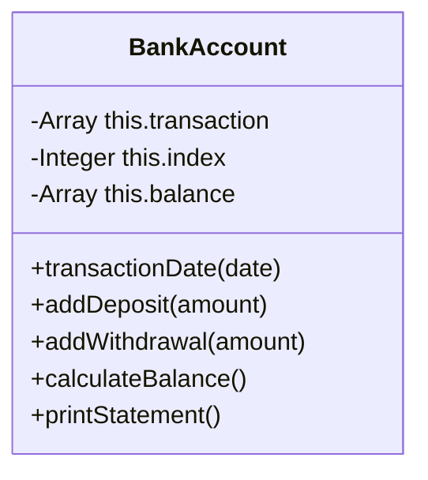

# Bank Account

This is a command line application that allows a user to view their bank statement. The statement includes the dates of their transactions, their credit, debit and balance.

## Specification

### Acceptance criteria

**Given** a client makes a deposit of 1000 on 10-01-2023  
**And** a deposit of 2000 on 13-01-2023  
**And** a withdrawal of 500 on 14-01-2023  
**When** she prints her bank statement  
**Then** she would see

```
date || credit || debit || balance
14/01/2023 || || 500.00 || 2500.00
13/01/2023 || 2000.00 || || 3000.00
10/01/2023 || 1000.00 || || 1000.00
```

## Diagrams

### UML Class Diagram

This diagrams displays the main class of this command line application - BankAccount.




### Inputs and Outputs

This diagram displays the expected inputs and outputs of this application.

| input                                                                                                                                                                             | output                                                                          |
|-----------------------------------------------------------------------------------------------------------------------------------------------------------------------------------|---------------------------------------------------------------------------------|
| bankAccount.transactionDate("14/01/2023"); bankAccount.addDeposit(1000); bankAccount.calculateBalance(); bankAccount.printStatement();                                  | 

```

date || credit || debit || balance

14/01/2023 || || 500.00 || 2500.00

13/01/2023 || 2000.00 || || 3000.00

10/01/2023 || 1000.00 || || 1000.00

```|
| bankAccount.transactionDate("14/01/2023");    bankAccount.addDeposit(1000);     bankAccount.addWithdrawal(500);     bankAccount.calculateBalance(); bankAccount.printStatement(); | date \|\| credit \|\| debit \|\| balance 14/01/2023 \|\| 1000 \|\| 500 \|\| 500 |
| bankAccount.transactionDate("14/01/2023"); bankAccount.addDeposit(1000);    bankAccount.addWithdrawl(2000);        bankAccount.calculateBalance(); bankAccount.printStatement();  | This withdrawal exceeds the current balance.                                    |

