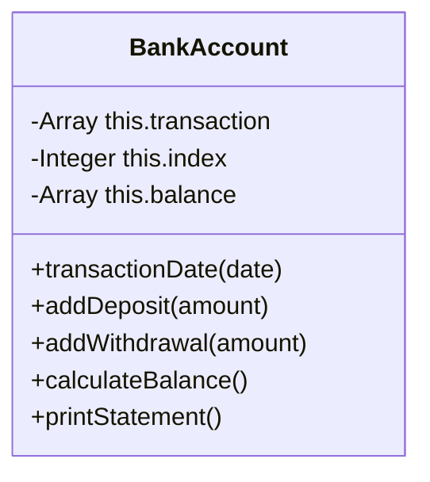
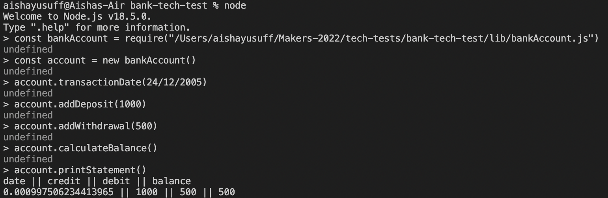

# Bank Account

This is a command line application that allows a user to view their bank statement. The statement includes the dates of their transactions, their credit, debit and balance.

## Specification

### Acceptance criteria

**Given** a client makes a deposit of 1000 on 10-01-2023  
**And** a deposit of 2000 on 13-01-2023  
**And** a withdrawal of 500 on 14-01-2023  
**When** she prints her bank statement  
**Then** she would see

```
date || credit || debit || balance
14/01/2023 || || 500.00 || 2500.00
13/01/2023 || 2000.00 || || 3000.00
10/01/2023 || 1000.00 || || 1000.00
```

### User Stories

Here is a list of user stories I made in order to create this application:

```
As an account owner
So that I can store my money in my account
I would like to deposit money in my account

```

```

As an account owner
So that I can access money inside my account
I would like to withdraw money from my account

```

```

As an account owner
So that I am aware of the activity of my account
I would like to see a statement of my account with dates, credits, debits and balances

```

```

As an account owner
So that I can have regular access to my account
I would like to make withdrawals and deposits from my account on multiple days

```

## Diagrams

### UML Class Diagram

This diagrams displays the main class of this command line application - BankAccount.



### Inputs and Outputs

This diagram displays the expected inputs and outputs of this application.

| input                                                                                                                                                                  | output                                                                          |
| ---------------------------------------------------------------------------------------------------------------------------------------------------------------------- | ------------------------------------------------------------------------------- |
| bankAccount.transactionDate("14/01/2023"); bankAccount.addDeposit(1000); bankAccount.calculateBalance(); bankAccount.printStatement();                                 | date \|\| credit \|\| debit \|\| balance 14/01/2023 \|\| 1000 \|\| \|\| 1000    |
| bankAccount.transactionDate("14/01/2023"); bankAccount.addDeposit(1000); bankAccount.addWithdrawal(500); bankAccount.calculateBalance(); bankAccount.printStatement(); | date \|\| credit \|\| debit \|\| balance 14/01/2023 \|\| 1000 \|\| 500 \|\| 500 |
| bankAccount.transactionDate("14/01/2023"); bankAccount.addDeposit(1000); bankAccount.addWithdrawl(2000); bankAccount.calculateBalance(); bankAccount.printStatement(); | This withdrawal exceeds the current balance.                                    |

## Technologies

This command line application was created using

- Eslint v8.20.0
- Jest v28.1.2
- Node v18.5.0
- Npm v8.12.1

## How to Get Started

To be able to run this command line application, you will need install the following packages:

Clone this repository

```
$ git clone https://github.com/Aisha-Yusuff/Bank-tech-test
```

Go into the repository

```
$ cd bank-tech-test
```

Install npm

```
$ npm install
```

Initialise the NPM project (this will create a file package.json)

```
$ npm init -y
```

Add the jest package to your project

```
$ npm add jest
```

Also install jest "globally"

```
$ npm install -g jest
```

You can then run test using this command

```
$ jest
```

Install ESlint

```
$ npm init @eslint/config
```

## How To Run This Application

In order to run this application, launch the node shell:

```
$ node
```

Create a variable and require the bankAccount class:

```
$ const bankAccount = require("<file-path>/bankAccount.js")
```

create an instance of the class:

```
$ const account = new bankAccount()
```

Then you can use all the class methods and print a statement like this:


